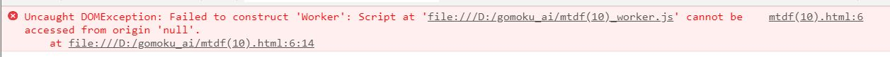

# gomoku_ai
Experiments with variations of minimax algorithm, MTD(f), MCTS in Gomoku   
mtdf(10) - dangerous prunning, can lead to unexpected game lose  
Main ai agent is in mtdf(10)_worker.js. You can play against ai here https://4battle.ru/game_offline

You can see this error while opening html files in Chrome  
  
Chrome doesn't let you load web workers when running scripts from a local file.
https://stackoverflow.com/questions/21408510/chrome-cant-load-web-worker
https://stackoverflow.com/questions/17679399/does-disable-web-security-work-in-chrome-anymore/36939693
